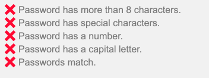

# React Password Checklist

[](https://www.npmjs.com/package/react-password-checklist2)   
<br /> [](https://travis-ci.com/usackoka/react-password-checklist2) [](https://coveralls.io/github/usackoka/react-password-checklist2?branch=master) [](https://github.com/usackoka/react-password-checklist2/issues) [](https://github.com/usackoka/react-password-checklist2/pulls) [](https://twitter.com/usackoka)

A React Component to display the success or failure of password strength rules that updates as a user types.

## Example



## Install in your project

`npm install --save react-password-checklist2`

`yarn add react-password-checklist2`

_Note: react is a peer dependency. You should be using this in a React project._

## Example Usage

```
import React, {useState} from "react"
import PasswordChecklist from "react-password-checklist2"

const SignUp = () => {
	const [password, setPassword] = useState("")
	const [passwordAgain, setPasswordAgain] = useState("")
	return (
		<form>
			<label>Password:</label>
			<input type="password" onChange={e => setPassword(e.target.value)}>
			<label>Password Again:</label>
			<input type="password" onChange={e => setPasswordAgain(e.target.value)}>

			<PasswordChecklist
				rules={["length","specialChar","number","capital","minus","match"]}
				minLength={5}
				value={password}
				valueAgain={passwordAgain}
				onChange={(isValid) => {}}
			/>
		</form>
	)
}
```

### Custom Messages/Translations

```
import React, {useState} from "react"
import PasswordChecklist from "react-password-checklist2"

const SignUp = () => {
	const [password, setPassword] = useState("")
	const [passwordAgain, setPasswordAgain] = useState("")
	return (
		<form>
			<label>Password:</label>
			<input type="password" onChange={e => setPassword(e.target.value)}>
			<label>Password Again:</label>
			<input type="password" onChange={e => setPasswordAgain(e.target.value)}>

			<PasswordChecklist
				rules={["length","specialChar","number","capital","minus","match"]}
				minLength={8}
				value={password}
				valueAgain={passwordAgain}
				messages={{
					length: "La contraseña tiene más de 8 caracteres.",
					specialChar: "La contraseña tiene caracteres especiales.",
					number: "La contraseña tiene un número.",
					capital: "La contraseña tiene una letra mayúscula.",
					minus: "La contraseña tiene una letra minúscula.",
					match: "Las contraseñas coinciden.",
				}}
			/>
		</form>
	)
}
```

## Available Rules

Customize the component to display only the rules you need in the desired order you wish to display them.

#### length

Valid if the password meets the minimum length. Requires `minLength` prop to be included.

#### specialChar

Valid if the password contains a special character from [this list](https://github.com/usackoka/react-password-checklist2/blob/master/src/index.tsx#L44).

#### number

Valid if the password contains a number.

#### capital

Valid if the password contains a capital letter.

#### minus

Valid if the password contains a lower case letter.

#### match

Valid if the password matches the confirm password valud. Requires `valueAgain` prop to be included.

## Props

| Prop         | Description                                                                                                        | Type     | Required                     | Default           |
| ------------ | ------------------------------------------------------------------------------------------------------------------ | -------- | ---------------------------- | ----------------- |
| rules        | Rules to display in the order desired.<br />Options are `length`, `specialChar`,<br />`number`, `capital`, `minus`, `match` | array    | yes                          |
| value        | Current potential password                                                                                         | string   | yes                          |
| minLength    | Minimum Password Length                                                                                            | number   | Only with<br />`length` rule |
| valueAgain   | Current potential password confirmation                                                                            | string   | Only with<br />`match` rule  |
| onChange     | Callback that is triggered when the<br />password becomes valid or invalid across<br />all rules.                  | function |                              | `(isValid) => {}` |
| messages     | Object with keys as rules, and values as strings to use as the message to be displayed                             | object   |                              |
| className    | Class applied to the entire component                                                                              | string   |                              |
| style        | Inline styles applied to the<br />outer component wrapper                                                          | object   |                              |
| iconSize     | Size of ✔ or 𐄂 icon                                                                                                | number   |                              | `18`              |
| validColor   | Color of checkmark icon                                                                                            | string   |                              | `#4BCA81`         |
| invalidColor | Color of X icon                                                                                                    | string   |                              | `#FF0033`         |

## Available Classes

- `.valid` - Valid Message
- `.invalid` - Invalid Message

## Run Locally

`npm run storybook`

`yarn storybook`
